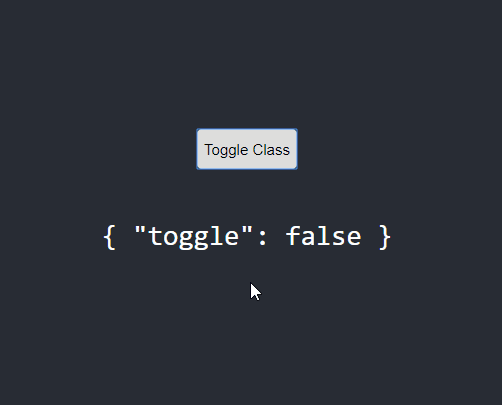

# with-animation

HOC that handles animation when mounting and unmounting a React component easily.

## Installation

```
npm install with-animation
```

## Usage

withAnimation wraps your custom React component.

```
import React, { Component } from 'react';
import withAnimation from 'with-animation';

const Block = (
  <div className="block">
    {this.props.children}
  </div>
);

export default withAnimation(NormalBlock);
```

The `mount` property will specify if the component should be mount. Both `onMount` and `onUnmount`
includes a CSS keyframe that will be executed when the component mounts or unmounts. Additional animations can be made on the component itself.

```
...

<button className="button" onClick={() => this.setState({ toggle: true });}>
  Toggle Class
</button>
          
<Block mount={toggle} onMount="in" onUnmount="out" defaultClass="wrapper" animateOnLoad={false}>
  Animated Block
</Block>
```

```
// App.css

@keyframes fadeIn {
  0% {
    opacity: 0;
    left: -200px;
  }
  100% {
    opacity: 1;
    left: 0px;
  }
}

@keyframes fadeOut {
  0% {
    opacity: 1;
    left: 0px;
  }
  100% {
    opacity: 0;
    left: 200px;
  }
}
```


## Example


## Properties

| prop            | Description   |
| --------------- | ------------- |
| mount           | Defines whether the component should be mounted on render. It's `true` by default.  |
| onMount         | Defines a keyframe to be executed when the component is mounted. |
| onUnmount       | Defines a keyframe to be executed when the component is unmounted. |
| defaultClass    | This sets default classes to the div created by the HOC that will be wrapping the component. |
| animateOnLoad   | Defines whether the `onMount` animation should be executed when the component is first rendered. It's `true` by default. |
